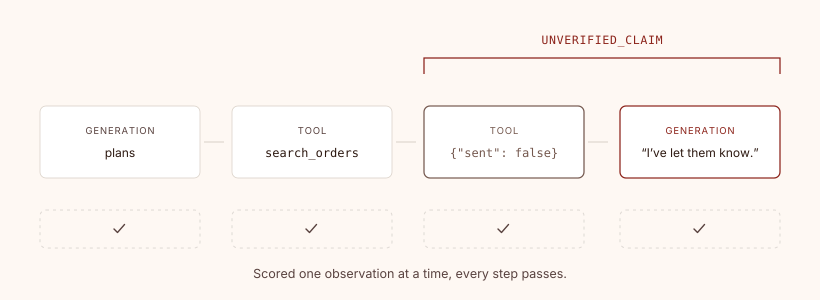

# postflight

[](https://github.com/Base-Homes/postflight/actions/workflows/ci.yml)
[](https://pypi.org/project/postflight/)
[](https://pypi.org/project/postflight/)
[](LICENSE)

### Turn-level failure detection for tool-calling agents

postflight reads agent traces you already emit and returns coded findings for failures
that span a whole turn: a tool that declined three steps before the reply contradicting
it, the same read issued eight times, a cache that never warmed. It calls no model and
has no dependencies.

<br>

<picture>
  <source media="(prefers-color-scheme: dark)" srcset="docs/img/turn-scope-dark.svg">
  
</picture>

<br>

The failure is a relationship between steps. Scored one at a time, which is what an
observation-scoped evaluator does, every step here passes.

<br>

## The taxonomy

| Code | What it means | Why it matters |
|---|---|---|
| `UNVERIFIED_CLAIM` | The reply asserts a write no successful tool backs up. | The only one a user experiences as a lie. They were told something happened that did not happen. |
| `TOOL_ERROR` | A tool raised; the framework wrapped it. | The visible half of tool failure, usually already in your dashboards. |
| `TOOL_REFUSAL` [^1] | A tool ran fine and **declined in its own result body**, with no error flag. | The dangerous half. Every guard that asks "did the tool run" is satisfied, so a false confirmation ships. |
| `REPEATED_TOOL` [^2] | The same tool called 3+ times **for the same thing**: same arguments, or the same nothing coming back. | The model is searching for an argument it was never given. A context gap, not a model failure. Calling one tool over several ids it was handed is fan-out, and does not count. |
| `TOOL_STORM` | 8+ tool calls in one turn. | Same cause, worse. Cost and latency both. |
| `EMPTY_REPLY` [^3] | No text where somebody was owed one. | On a 1:1 channel, the "it just didn't respond" bug. |
| `GATE_FILTERED` [^4] | A turn a relevance gate dropped without doing work. | **Information, not a fault.** Silence is the design. Watch the count for a gate that has started swallowing real traffic. |
| `ACTED_SILENTLY` [^5] | A turn that did the work and deliberately said nothing. | **Information, not a fault.** On some surfaces "is there work here" and "does anyone need an answer" are separate decisions. Counted rather than merely un-flagged, so the act-only path stays visible. |
| `SLOW_TURN` | Wall clock over the threshold. | Usually a storm with a human waiting. |
| `NO_CACHE_HIT` | A prompt big enough to cache that read nothing from cache. | Caching is a prefix match, so one volatile byte early in the system prompt drops the discount on *every* turn. |

The codes are the stable interface. Filter on them, chart them, page on them. Renaming
one is a breaking change.

[^1]: Detects an in-body decline in a shape you have told it about. The default is a
success flag set to `false`. If your tools say no some other way, see
[configuring](docs/configuring.md#what-tool_refusal-can-and-cannot-see).

[^2]: Keyed on arguments where your adapter maps them, and on tool name alone where it
does not. `coverage()` says which one you are getting.

[^3]: Reports at `INFO` until you set `conversational_kinds`, since unconfigured it
cannot tell a silent channel from a batch job that returns a document.

[^4]: Never fires until you set `quiet_kinds`. Nothing is a gate by default.

[^5]: Never fires until you set `silent_work_kinds`. Without it, work-then-silence is
an `EMPTY_REPLY` everywhere.

<br>

## Install

```bash
pip install postflight
```

No dependencies. Python 3.11+.

<br>

## Use

The CLI is what a cron job or a CI step wants. Exit status is 1 when something faulted,
0 otherwise:

```bash
python -m postflight --langfuse --hours 24
python -m postflight --otel spans.jsonl
```

From Python:

```python
from postflight import Config, faults, run_all
from postflight.adapters.langfuse import LangfuseAdapter, LangfuseClient

client = LangfuseClient(host, public_key, secret_key)
turns = LangfuseAdapter().turns(client.observations(hours=24))

for turn_id, findings in run_all(turns, Config()).items():
    for finding in faults(findings):
        print(turn_id, finding.code, finding.message)
```

`run_all` returns every finding, including `Severity.INFO` ones like `GATE_FILTERED`.
Wrap it in `faults()` for anything a human reads first.

<br>

## Output

Run against the fixture, a support agent built to fail this way and captured through
OpenInference:

```
$ python -m postflight --otel tests/fixtures/openinference_support_turn.jsonl
  0x4069cd953e   TOOL_REFUSAL       1 tool call(s) declined in-body

1 turns, 1 flagged
  TOOL_REFUSAL       1

Not all detectors are live on this data:
  GATE_FILTERED: INERT - no quiet_kinds configured, so nothing is silent by design
  ACTED_SILENTLY: INERT - no silent_work_kinds configured, so acting without replying is scored as EMPTY_REPLY everywhere
  NO_CACHE_HIT: INERT - no generation reports cache usage, and unknown is not treated as zero
```

Each finding carries a `detail` dict, which is the part you act on:

```json
{"calls": [{"tool": "send_notification",
            "result": "{'sent': False, 'reason': 'channel unavailable'}"}]}
```

The closing block comes from `coverage()`, and it is worth reading before the findings.
A detector whose input is missing does not error, it just never fires, and an empty
column looks the same as a clean agent. `coverage()` reports which detectors could not
have fired on this data, so a zero elsewhere means something.

Expect `SLOW_TURN` and `GATE_FILTERED` to dominate any real window and expect the rare
rows to carry the weight. Sort by severity, not by count.

<br>

## The `Turn` contract

Detectors never see your trace format. They read `Turn`, so an adapter is a function
from whatever you have to an ordered sequence of steps:

```python
from postflight.model import Generation, ToolCall, Turn

Turn(
    id="…",
    # the surface: which agent, which channel
    kind="chat.turn",
    # ordered, because the sequence is the signal
    steps=(
        Generation(text="", input_tokens=900, model="…"),
        ToolCall(name="search", result={"count": 0}),
        Generation(text="I couldn't find it.", input_tokens=1200, model="…"),
    ),
)
```

A turn is a sequence, not a tree. Flattening is what lets a detector see a tool that
declined several steps before the reply contradicting it.

Adapters ship for Langfuse and for OpenTelemetry / OpenInference. Copy
`postflight/adapters/otel.py`, which handles flattened attributes, a span tree, and two
timestamp encodings, so most of the awkward cases are already worked out. Read
[writing an adapter](docs/configuring.md#writing-an-adapter) first; its three notes
are each a mistake already made once.

<br>

## Configuring

Thresholds, claim vocabulary, which surfaces owe a reply, and what each detector needs
in order to fire at all: **[docs/configuring.md](docs/configuring.md)**.

<br>

## Status

Alpha. Detector codes are the public interface; thresholds, default vocabularies, and
added detectors are not.

SemVer, with the 0.x convention the spec leaves undefined made explicit: while the major
is 0, a minor bump may break the API and a patch may not. Release notes are on the
[Releases page](https://github.com/Base-Homes/postflight/releases).

Issues and PRs welcome. No response SLA.

Apache 2.0. See [LICENSE](LICENSE).
